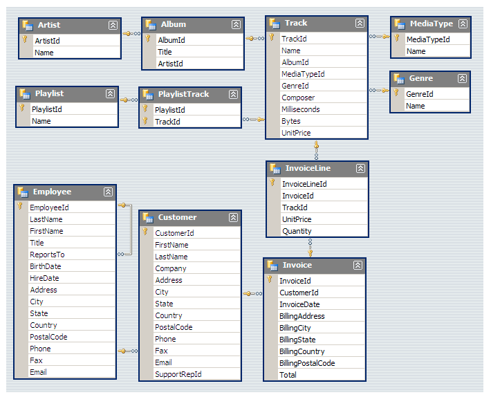

# SQL-Music-Store-Analysis
Music store data analysis using sql
# 🎵 Music Store SQL Data Analysis

## 📌 Project Description

This project explores a music store database using SQL to uncover customer spending behavior, top-performing artists, and genre popularity across countries. It demonstrates beginner to advanced SQL skills using joins, aggregations, subqueries, CTEs, and window functions.

---

## 🧩 Database Schema

The analysis is based on a schema similar to the Chinook music database. Below is the ER diagram representing the database structure:

---

## 🗃️ File Contents

- `analysis_query.sql` – SQL queries grouped into:
  - **Easy** – Basic aggregations, filtering, and ordering
  - **Moderate** – Complex joins, subqueries, distinct selections
  - **Advanced** – CTEs and window functions for deeper insights

---

## 🔍 Key Insights Extracted

- Senior-most employee by title level
- Countries and cities generating highest revenue
- Top 3 invoice values
- Best customers by total spending
- Most popular genres per country
- Top rock bands by number of tracks
- Longest songs by duration
- Customer spending on best-selling artist
- Top spenders in each country

---

## 🛠️ Technologies Used

- SQL (compatible with PostgreSQL, MySQL)
- Chinook-like music store database
- SQL client (e.g., pgAdmin, DBeaver, MySQL Workbench)

---

## 🚀 How to Use

1. Import the Chinook or similar music database into your SQL environment.
2. Open and run the queries from `analysis_query.sql`.
3. Modify queries or schema as needed for your SQL dialect.

---

